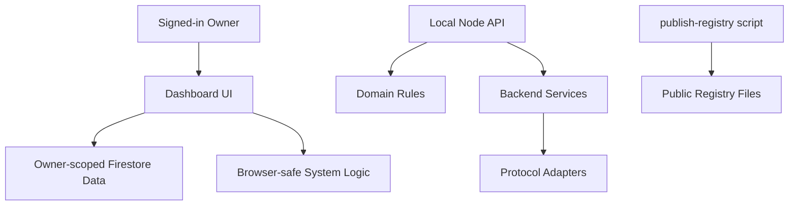

# Dnols Architecture

Dnols is organized around a simple rule: business behavior belongs in pure domain modules, system integrations belong in services, protocol shapes belong in adapters, and browser code should only orchestrate the signed-in owner's dashboard.

## Layers

```text
Browser UI
  public/*.html
  public/js/*

Shared browser/domain logic
  public/system-logic.js

Backend domain logic
  src/domain/*

Backend services
  src/services/*

Protocol adapters
  src/adapters/*

Entry points
  src/server.js
  src/cli.js
  scripts/publish-registry.js
```

## Ownership

- `src/domain/`: pure business rules with no network calls, no file writes, and no secrets. Examples: ACM validation, low-cost Claude capsules, deal evaluation, negotiation state.
- `src/services/`: integrations and system behavior. Examples: website extraction, payments, execution planning, static registry generation.
- `src/adapters/`: protocol-specific projections from Dnols data into external standards such as MCP, A2A, and ARD.
- `public/js/`: browser modules for authenticated dashboard flows. These modules must never contain API secrets or cross-owner data access.
- `public/`: hosted static pages and generated public registry files. Generated files are public and must contain only reviewed safe fields.
- `data/`: local seed data and reviewed public profile source records.
- `test/`: focused tests by domain/service/browser logic.

## Data Flow



## Security Rules

- Owner-private records stay under owner-scoped Firestore paths.
- Public registry files never include private negotiation rules, API secrets, hidden minimum prices, or internal notes.
- Claude or other LLM keys must never be placed in browser files.
- LLM calls must use compact capsules from `src/domain/llm-costing.js` and verified owner identity.
- Refactors must preserve Firestore collection names unless a separate migration plan exists.

## Migration Pattern

When moving code, prefer compatibility re-exports:

```js
export * from "../domain/example.js";
```

This lets older imports keep working while new code uses the clearer architecture path. Remove compatibility files only after tests and deployed browser imports are stable.
